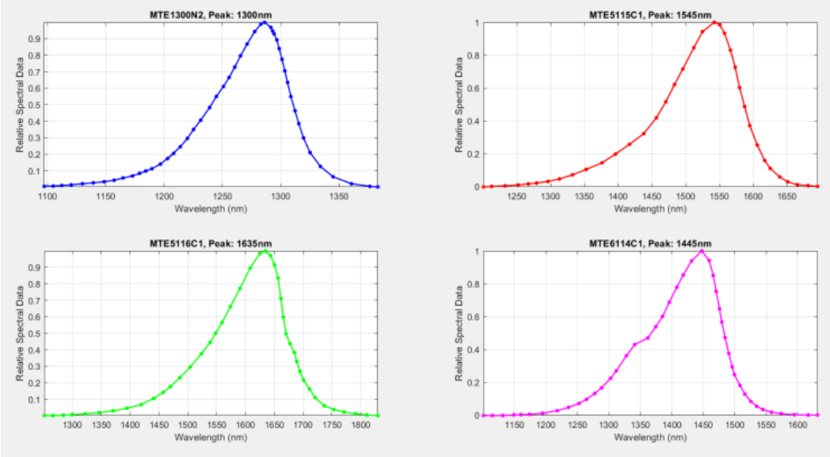
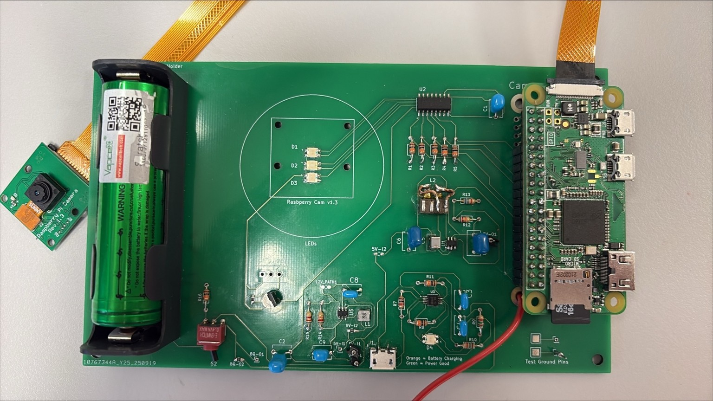

# Multispectral Imaging System
> This project focuses on designing and implementing a cost-effective, automated multispectral imaging system.
> 
> ⚠️ **Disclaimer:** Please note that comprehensive technical details, specific schematic parameters, and proprietary source code have been intentionally omitted from this public repository for academic confidentiality and intellectual property reasons.
---
## Phase 1: System Concept & Hardware Design
The primary objective of this project is to develop an accessible and cost-effective alternative to highly expensive, commercially available multispectral cameras. The proposed system achieves this by sequentially illuminating a target object with specific LED wavelengths and capturing the resulting reflections using an appropriate optical camera. To ensure precise illumination, the emission spectrum of the LEDs was carefully analyzed to correlate driving currents with their corresponding wavelength peaks.

  
   
  <em><b>Figure 1:</b> Analysis of emitted LED wavelengths relative to their driving currents.</em>

Based on this optical foundation, a dedicated electronic schematic was developed. The LED driver circuit was designed using the **TPL7407L** high-current NMOS transistor array to guarantee safe and accurate switching. A **Raspberry Pi** was integrated as the core system controller. Custom Bash scripts were developed for the command-line interface, allowing the system to automatically trigger specific LED wavelengths in sequence and synchronously capture the corresponding images.

  
   
  <em><b>Figure 2:</b> Circuit schematic of the LED driver utilizing the TPL7407L array and Raspberry Pi interface.</em>

Once the electronic architecture and software control algorithms were thoroughly validated, the physical Printed Circuit Board (PCB) was designed, fabricated, and assembled to create the functional prototype of the imaging system.

  
   
  <em><b>Figure 3:</b> The final fabricated and assembled PCB prototype of the multispectral imaging system.</em>

